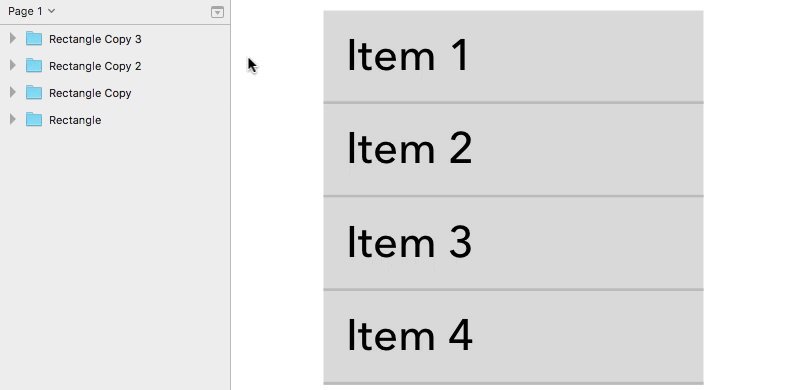
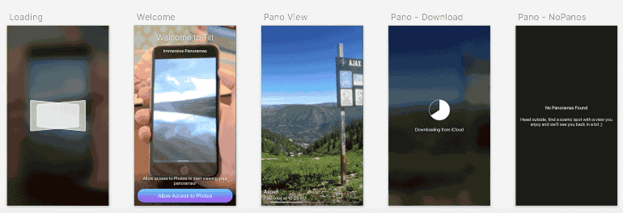
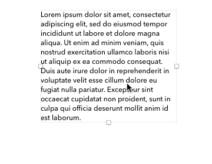

# SketchPlugins

These plugins are very much a work in progress, the plan is for them to only use the [SketchAPI](https://github.com/BohemianCoding/SketchAPI) which is still under active development too.

## Organize Layers
Renames and orders layers in the layer list based on their screen layout.

### TODO
- [ ] Improve plugin for selections that span differnt groups
- [ ] Custom user interface

## Export Page
Export all the artboards on the page to an image with artboard titles.

### TODO
- [ ] [Automate Export](https://github.com/BohemianCoding/SketchAPI/pull/9)
- [ ] Custom user interface(title options, output options)

## Mobile Export - TBD
Export assets for all mobile sizes with platform naming conventions.

### iOS
- Naming: "Image Name" -> "ImageName"
- Sizes: @1x, @2x, @3x

### Android
- Naming: "Image Name" -> "image_name"
- Sizes: ldpi(0.75x), mdpi(1x), hdpi(1.5x), xhdpi(2x), xxhdpi(3x), xxxhdpi(4x)

### TODO
- [ ] Build it ;)
- [ ] [Automate Export](https://github.com/BohemianCoding/SketchAPI/pull/9)

## Golden Ratio Text
Port of [this](https://github.com/lorenzwoehr/Golden-Ratio-Line-Height-Sketch-Plugin) plugin.

### TODO
- [ ] [Read](https://pearsonified.com/2011/12/golden-ratio-typography.php)
- [ ] Write unit tests
- [ ] Port plugin to SketchAPI

## Resources:
- http://developer.sketchapp.com/introduction/plugin-bundles/
- https://github.com/abynim/Sketch-Headers
- https://github.com/romannurik/Sketch-NibUITemplatePlugin
